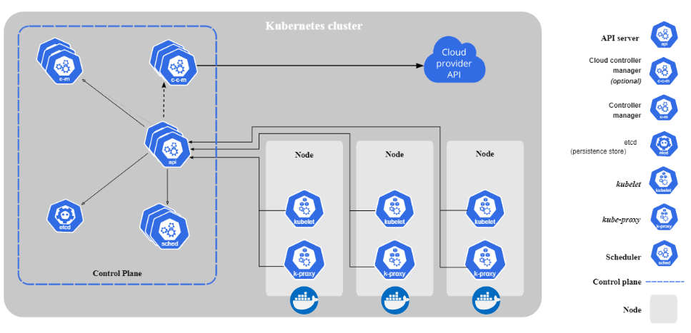
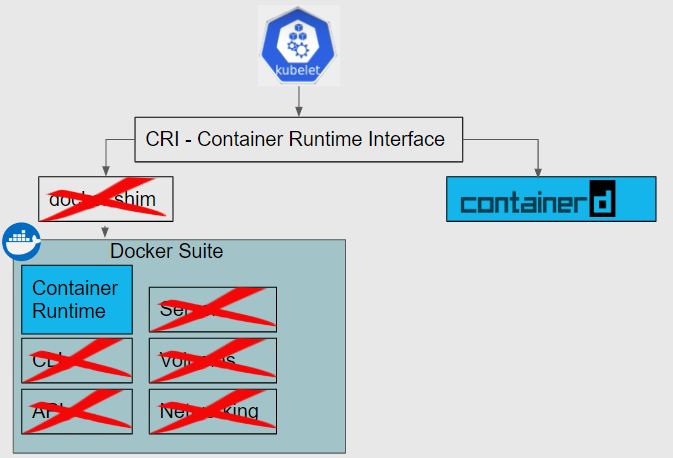
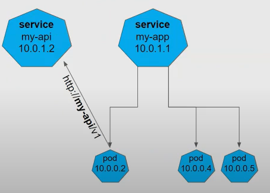
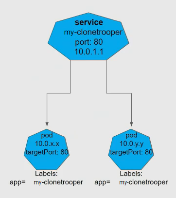
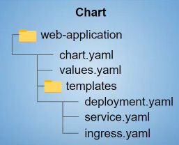

# Kubernetes

# Architecture


- The control plane is the _brains_ of the operation.
- Control plane nodes are usually odd numbered (3 in our case), to prevent split-brain situations (where nodes lose contact with each other and write different things)
- The API server is the entrypoint to the server
    - Exposes a RESTful API to post yaml configuration files (mainfests) to
- The manifest describes desired state of a K8s application
    - Container image
    - Exposed ports
    - How many pod replicas
- The scheduler assigns pods to worker nodes (on the bottom right). Checks if node has compatibility and capacity
- etcd holds the state of the system
- The controller manager keeps track of what's going on in the cluster: observed state = desired state?
    - The controllers are constantly polling the cluster to observe

Root Nodes:
- `kubelet` application that runs on each node in the cluster. Ensures app is running in pods, and sends current state back to control plane
- `kube-proxy` maintains network rules
    - IP address, ingress, egress
- Container runtime. K8s just orchestrates containers, but the running of the containers is offloaded

## Contexts
K8's `.config` file is filled with contexts that look like:

```shell
- context:
    cluster: [cluster]
    namespace: [namespace]
    user: [user]
  name: [name]
```

The `cluster` is the API URL. A cluster can be _namespaced_, which splits it further into virtual clusters each with their own permissions etc. Resources may be namespaced.

Switching to a context:

```shell
kubectl config get contexts
```
```shell
kubectl config use-context [context]
```

## Containers


K8s talks to a Container Runtime Interface, which then talks to the container runtime. However, K8s doesn't need Docker's full suite of functionality (e.g. it already has its own networking functionality), so Docker has released its own container runtime called Container D, which K8s uses. Use of Docker via docker shim is no longer supported.

## Pods
Smallest unit in K8s
Typically one container per pod, with own IP address.
- _Can_ run 2 containers per pod, but usually as sidecars, doing monitoring etc. Containers within a pod can talk to each other via `localhost`
- One container could also be a _service mesh_, taking care of non business-logic things.

You would typically not deploy just a single pod by itself. You wouldn't be making use of K8's orchestration features, and if the pod dies then that's it.

## Deployments
Deployments provide features such as:
- self healing
- scaling
- zero-downtime rollouts
    - Rollouts create new pods, and delete old pods only once the new pod is active
- versioned rollbacks
    - By default last 10 replica sets are kept around
to a pod.


### Manifests
Everything in K8s is described as manifest files (which are posted to the control plane API)

Sample deployment manifest:

```yaml
apiVersion: apps/v1
kind: Deployment
metadata:
  name: my-clonetrooper
  labels:
    app: my-clonetrooper
spec:
  selector:
    matchLabels:
      app: my-clonetrooper
  replicas: 2
  template:
    metadata:
      labels:
        app: my-clonetrooper
    spec:
      containers:
      - name: my-clonetrooper
        image: clonetrooper:0.1
        imagePullPolicy: Always
        ports:
        - containerPort: 80
```

- `> kubectl api-resources` will list all the API resources available within kubernetes. For exmaple one of the respones is:
    ```
    NAME               SHORTNAMES     APIVERSION         NAMESPACED   KIND
    deployments        deploy         apps/v1            true         Deployment
    ```
    which specifies which API version to use if we want to post a deployment manifest

- `spec:` Is the specification of what you want the dployment to actually look like
    - `matchLabels` will apply this deployment to any pods that match the label kvp
- `template:` Template for pods that get created during the deployment

Deploying from a manifest file:
```shell
kubectl apply -f Deployment.yml
```

### Replica Sets & Rollouts

A deployment will create a _ReplicaSet_, which maintains a stable set of replica pods running at any given time. A deployment provides a high level abstraction over ReplicaSet, so you probably never need to manually create one. The control plane contains a ReplicaSet controller that ensures observed state = desired state, deploying up the appropriate number of pods.

By default, the last 10 replica sets are kept, so we can rollback to previous deployment revisions. When rolling back, the previous replica set's pods will just be populated and the rest set to 0.

Here's the flow of how this works:

```shell
> kubectl apply -f Deployment.yaml
deployment.apps/my-cool-app configured

> kubectl get deployment
NAME          READY   UP-TO-DATE   AVAILABLE   AGE
my-cool-app   2/2     1            2           5s

> kubectl get replicaset
NAME                     DESIRED   CURRENT   READY   AGE
my-cool-app-ccc7789b5    2         2         2       10s
```

Deploying an updated image
```shell
> kubectl apply -f DeploymentV2.yaml
deployment.apps/my-cool-app configured

> kubectl get deployment
NAME          READY   UP-TO-DATE   AVAILABLE   AGE
my-cool-app   2/2     1            2           5m

> kubectl get replicaset
NAME                     DESIRED   CURRENT   READY   AGE
my-cool-app-76fc796d4b   2         2         2       11s
my-cool-app-ccc7789b5    0         0         0       5m
```

Note the deployment stays the same (as indicated by the age), and the old replicaset still remains (and simply has 0 pods)

We can view deployment rollout history via

```shell
> kubectl rollout history deployment
deployment.apps/my-cool-app
REVISION  CHANGE-CAUSE
1         <none>
2         <none>
```

Performing a rollback:

```shell
> kubectl rollout undo deployment m-cool-app --to-revision=1
deployment.apps/my-cool-app rolled back

> kubectl get replicaset
NAME                     DESIRED   CURRENT   READY   AGE
my-cool-app-76fc796d4b   0         0         0       2m
my-cool-app-ccc7789b5    2         2         2       7m

> kubectl rollout history deployment
deployment.apps/my-cool-app
REVISION  CHANGE-CAUSE
2         <none>
3         <none>
```

Hooray! Everything seems to be working properly

In the real world you would be unlikely to manually roll back K8s deployments, but rather fix the issue at the source and run your CI/CD pipeline


## Services
As we know, pods are ephemeral, and get removed/spun up as needed. As such, we can never rely on a pod's IP address

A _service_ has a static IP address, and load balances traffic to pods. It has a name registered in DNS.



Pods can address services directly by their service name (service discovery) within a kubernetes cluster

### Service Manifest
```yaml
apiVersion: v1
kind: Service
metadata:
  name: my-clonetrooper
spec:
  selector:
    app: my-clonetrooper
  ports:
    - protocol: TCP
      port: 80
      targetPort: 80
```


`kubectl get service` to see list of services
`kubectl get endpoints` to see pod endpoints attached to Service

However, our service currently does not have ingress. We can only `curl` into the _cluster IP_ from within the same cluster.

## Ingress
Ingress will open up our cluster by assinging by registering a DNS hostname. We can use a reverse proxy to achieve this. Ingress does not necessarily have to mean internet ingress, and can be within specific environments.

Ingress is set up as an _ingress service_ within the cluster, running ingress pods (e.g. Nginx). The ingress pods will then talk to the main service

### Ingress manifest
```yaml
apiVersion: networking.k8s.io/v1
kind: Ingress
metadata:
  name: billy-clonetrooper
  labels:
    app: billy-clonetrooper
spec:
  ingressClassName: nginx
  rules:
    - host: billy-clonetrooper.some-url.com
      http:
        paths:
          - path: /
            pathType: Prefix
            backend:
              service:
                name: billy-clonetrooper
                port:
                  number: 80
```

> Note: In terms of service vs ingress, it is usually recommended to use service-level addressing when talking between pods (e.g. BFF to API), so the traffic never leaves the Kubernetes network

# Helm
Helm helps you package K8s applications, and is created to template an application.


A helm chart is just a collection of files/templates. It takes in your custom values along with the chart, and generates the manifest files required to post to the K8s api.
Helm deployments are called _releases_ instead of _rollouts_.

# Troubleshooting
1. Switch to the correct K8s context
    ```shell
    > kubectl config get-contexts
    > kubectl config use-context [appropriate context]
    ```
2. View list of pods
    ```shell
    kubectl get pods
    ```
3. We can events by running either of:
    ```shell
    > kubectl describe pod [pod]
    > kubectl describe replicaset [replicaset]
    ```

    `kubectl describe pod` will allow you to see most template spec details including:
        - labels
        - image
        - port
4. We can also view logs using
    ```shell
    > kubectl logs [pod]
    ```

To delete a pod:
```shell
kubectl delete [pod]
```
and a new one should spin up

Get deployments with
```shell
kubectl get deployments
```
